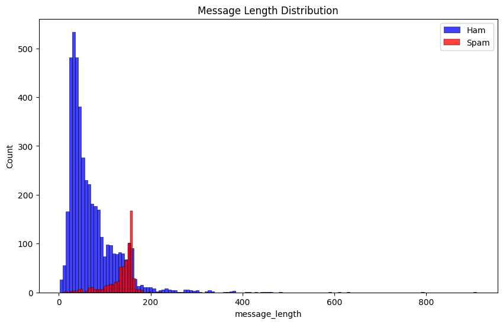
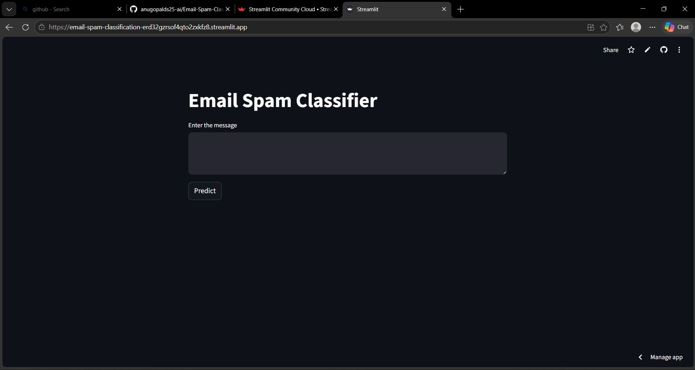

# Exploratory Data Analysis (EDA)

Predictive Analytics Group Project | Academic Year 2025–26

---

# Team Members

| Name |
|---|
| Fidal Govind |
| Arjun S |
| ANU GOPAL V |

---

# Problem Statement

Email spam remains a major challenge in modern digital communication. Spam messages waste user time, consume infrastructure resources, and often contain phishing links, malware, and fraudulent content. 

This project aims to build an intelligent Email Spam Classification system using Natural Language Processing (NLP) and Machine Learning techniques to automatically classify emails as:

- Spam
- Ham (Legitimate Email)

The project compares multiple machine learning algorithms and deploys the best-performing model using Streamlit.

---

# Project Motivation

The increasing volume of spam emails creates serious issues including:

- Phishing attacks
- Financial fraud
- Malware distribution
- Productivity loss
- Storage and bandwidth waste

An automated spam filtering system helps users and organizations improve security and communication efficiency.

---

# Dataset Description

## Dataset Used

SpamAssassin Public Dataset

## Dataset Features

| Feature | Description |
|---|---|
| label | Spam or Ham |
| message | Email text message |

## Dataset Characteristics

- Text-based email dataset
- Binary classification problem
- Contains spam and non-spam messages
- Used for NLP preprocessing and ML model training

---

# Methodology

The project follows a complete machine learning lifecycle workflow.

# Exploratory Data Analysis (EDA)

Exploratory Data Analysis was performed to better understand the characteristics of the email dataset before preprocessing and model training.

The analysis focused on:
- Class distribution of spam and ham emails
- Message length patterns
- Dataset balance and text behavior

### 2. Class Distribution
Visualized the number of:
- Spam messages
- Ham messages

## Spam vs Ham Distribution

The dataset contains both spam and legitimate (ham) email messages. 

The visualization below shows the distribution of the two classes in the dataset.

### Observation

- Ham messages are significantly higher than spam messages.
- The dataset is slightly imbalanced.
- Despite imbalance, sufficient spam samples exist for training robust classifiers.


---

## Message Length Distribution

Message length analysis was performed to study the variation in email content size.

### Observation

- Spam messages generally contain longer and more promotional content.
- Ham messages are comparatively shorter and conversational.
- Message length acts as an informative feature during classification.



---

## EDA Summary

From the exploratory analysis, several important insights were identified:

- Spam emails often contain repetitive promotional patterns.
- Ham emails are more naturally structured.
- Text preprocessing is necessary to reduce noise and improve model performance.
- Feature extraction techniques like TF-IDF can effectively capture important textual patterns for classification.

The EDA phase helped guide preprocessing and model selection strategies used later in the project.

## 2. Text Preprocessing

Applied preprocessing techniques such as:
- Lowercase conversion
- Tokenization
- Stopword removal
- Punctuation removal
- Stemming using Porter Stemmer

## 3. Feature Extraction

Used:
- TF-IDF Vectorization

to convert text into numerical feature vectors.

## 4. Model Training

After preprocessing and TF-IDF feature extraction, the dataset was divided into training and testing sets using Scikit-learn.

The transformed textual features were used to train multiple machine learning models for spam classification.

---

# Models Implemented

The following machine learning algorithms were trained and compared:

| Model | Description |
|---|---|
| Naive Bayes | Probabilistic classifier commonly used in NLP tasks |
| Logistic Regression | Linear classification algorithm |
| Support Vector Machine (SVM) | Margin-based supervised learning model |
| Random Forest | Ensemble learning classifier using decision trees |

---

# Training Workflow

The training process involved:
- Splitting the dataset into training and testing data
- Fitting machine learning models using TF-IDF vectors
- Generating predictions on unseen testing data
- Comparing model performances

Scikit-learn libraries were used for model implementation and training.

---

# Feature Representation

TF-IDF vectorization was used to convert textual email messages into numerical feature vectors suitable for machine learning algorithms.

This helped models identify important spam-related textual patterns.

---

# Training Objective

The main objective of the training phase was to identify the model that provides:
- High accuracy
- Better spam detection capability
- Lower false classification rates
- Stable performance on unseen data

The trained models were later evaluated using multiple performance metrics.

## 5. Model Evaluation

After training the machine learning models, evaluation was performed to measure their effectiveness in classifying spam and legitimate email messages.

Multiple evaluation metrics and visual analysis techniques were used to compare model performance.

---

# Evaluation Metrics Used

The following metrics were used:

- Accuracy Score
- Precision
- Recall
- F1-Score
- Confusion Matrix

These metrics helped evaluate the classification capability of each machine learning model.

---

# Classification Report Analysis

Classification reports were generated for:
- Naive Bayes
- Logistic Regression
- Support Vector Machine (SVM)
- Random Forest

The reports measured:
- Spam detection performance
- False positive rates
- Overall prediction quality

---

# Confusion Matrix Analysis

The confusion matrix analysis showed that the SVM model correctly classified most spam and ham messages with minimal prediction errors.

Observations:
- High true positive rate
- Low false positive rate
- Good spam detection capability
- Strong generalization on testing data

---

# Model Comparison Analysis

The performance comparison between all trained models showed that:

- Support Vector Machine (SVM) achieved the highest accuracy
- Logistic Regression and Naive Bayes also performed effectively
- Random Forest produced comparatively lower performance for this NLP classification task

---

# Final Model Selection

Based on the evaluation metrics and overall prediction performance:

## Selected Model:
Support Vector Machine (SVM)

### Reasons for Selection

- Highest accuracy among tested models
- Better classification consistency
- Lower misclassification rate
- Strong performance on TF-IDF textual features

The trained SVM model was selected for deployment in the Streamlit web application.

---

# Evaluation Summary

The evaluation phase demonstrated that machine learning models combined with NLP preprocessing can effectively classify spam emails with high reliability and accuracy.

The deployed application successfully performs real-time spam prediction using the trained SVM classifier.

## 6. Deployment

The best-performing SVM model was deployed using:
- Streamlit

---

# Technologies Used

| Technology | Purpose |
|---|---|
| Python | Core Programming |
| Pandas | Data Handling |
| NumPy | Numerical Operations |
| NLTK | NLP Preprocessing |
| Scikit-learn | Machine Learning |
| Matplotlib | Visualization |
| Seaborn | Visualization |
| Streamlit | Deployment |
| Pickle | Model Serialization |

---

# Project Structure

```text
Email-Spam-Classification/
│
├── models/
├── notebooks/
├── results/
├── screenshots/
├── app.py
├── requirements.txt
└── README.md
```

---

# Results Summary

## Best Performing Model

Support Vector Machine (SVM)

## Evaluation Metrics

The SVM model achieved the highest accuracy among all tested machine learning models.

Visualizations included:
- Confusion Matrix
- Model Comparison Graph

 ## Confusion Matrix

 

## Model Comparison Graph


---

# Screenshots

The following screenshots demonstrate the working of the deployed Email Spam Classification application developed using Streamlit.

The application allows users to enter an email message and instantly predicts whether the message is Spam or Ham using the trained Support Vector Machine (SVM) model.

---

## Application Homepage

The homepage provides a simple and user-friendly interface where users can enter email content for classification.



---

## Spam Prediction Result

This screenshot demonstrates the successful detection of a spam email message by the trained machine learning model.


---

## Non-Spam Prediction Result

This screenshot demonstrates the classification of a legitimate (ham) email message by the deployed application.


---

# Deployment Link

[Open Streamlit App](https://email-spam-classification-erd32gzrsof4qto2zxkfz8.streamlit.app/)

---

# How to Run the Project Locally

## 1. Clone Repository

```bash
git clone https://github.com/fidalgovind/Email-Spam-Classification.git
```

## 2. Navigate to Project Folder

```bash
cd Email-Spam-Classification
```

## 3. Install Dependencies

```bash
pip install -r requirements.txt
```

## 4. Run Streamlit App

```bash
streamlit run app.py
```

---

# Conclusion

This project demonstrates how NLP and Machine Learning can be effectively used for automated spam email detection. The deployed application provides real-time spam classification using an optimized SVM model.


